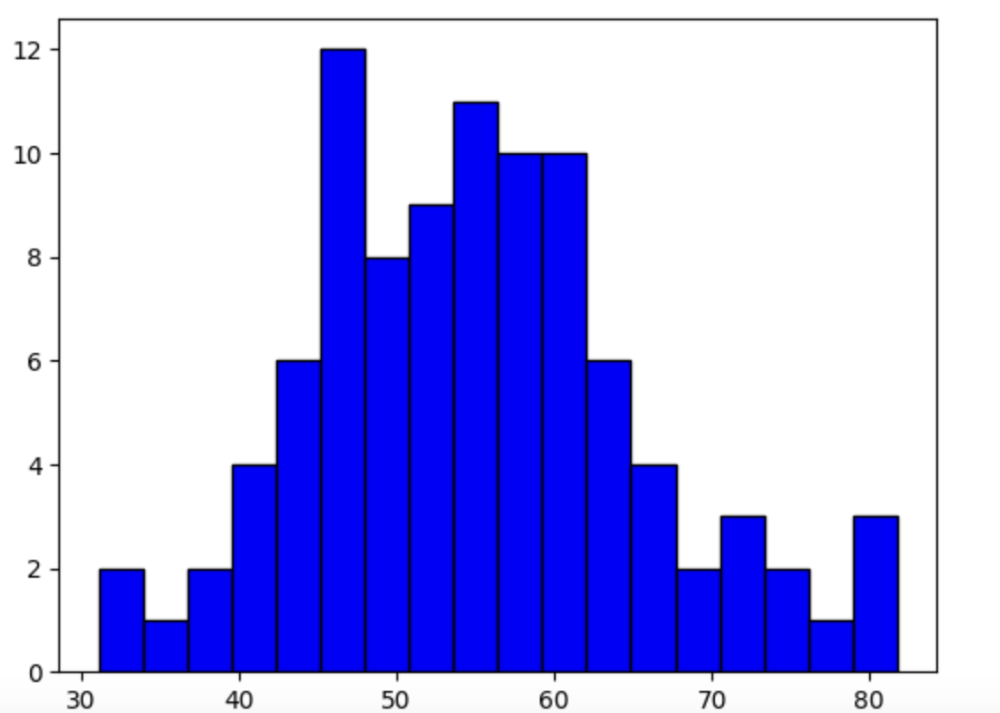

# Лабораторная работа 1

## Часть 1 

### Задание 1

**Найти на сайте РосСтат https://rosstat.gov.ru/free_doc/new_site/zdor22/PublishSite_2022/index.html данные, распределение которых было бы близко к a) нормальному (визуально выглядит как кривая Гаусса - «колокол»), б) равномерному.**

Примером нормального распределения на сайте РосСтата является статистика [Населения, прошедшее диспансеризацию в последние два года
](files/1.xlsx)

 
### Задание 2
**Найти распределение со смещенной медианой относительно среднего (~15% размаха) и несмещенной.**

### Задание 3
**Посчитать описательные характеристики распределения выбранных данных (среднее, мода, медиана),  дать визуальное представление данных (условное форматирование Excel, построить график рассеивания/гистограмму/круговую диаграмму).**

## Часть 2

### Задание 4

**Найти датасет с аномальными значениями, которые можно выявить, построив диаграмму размаха «ящик с усами». Попробовать выдвинуть гипотезу о причинах аномальности, которую можно подтвердить дальнейшими исследованиями, используя синтетические признаки (или  корреляционный анализ и т.п.).**

